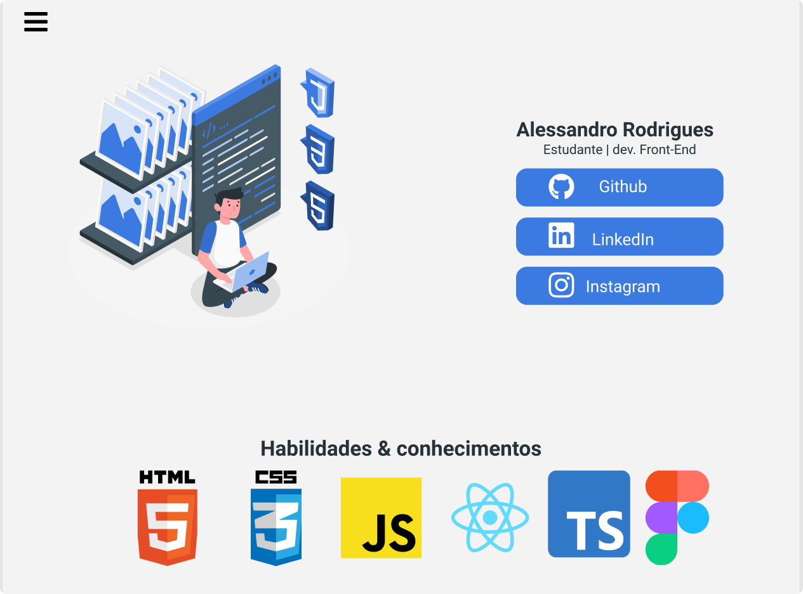

# Meu portfolio
Esse será o meu portfolio, tem como objetivo centralizar e organizar meus projetos estudantis, além de futuramente profissonais. :) 

<h1>
  
</h1>


<br>

## 🧪 Tecnologias 

Esse projeto foi desenvolvido com as seguintes tecnologias:

- [React](https://reactjs.org)
- [TypeScript](https://www.typescriptlang.org/)
- [Figma](https://www.figma.com/)

## Como executar 

Clone esse projeto e acesse a pasta

```bash
$ git clone https://github.com/alessandrordgs/Portfolio.git
$ cd Portfolio
```

Para iniciá-lo, siga os passos abaixo:
```bash
# Instalar as dependências
$ yarn
# Iniciar o projeto
$ yarn start
```